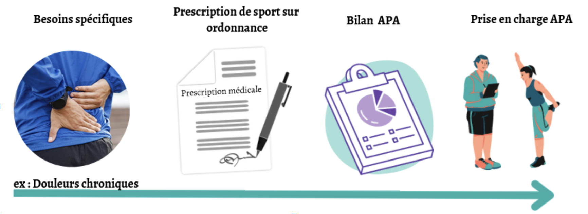

# Accompagnement dans vos objectifs bien être et santé 

Il est parfois difficile de trouver le temps de prendre soin de notre santé physique. C’est là que notre expertise entre en jeu.

En tant qu’expert de <a href="#apa-section">l’activité physique adaptée (APA)</a>, **TRAINING APA** conçois des programmes sur mesure qui s'adaptent à votre niveau de condition physique, à vos préférences et à vos besoins spécifiques.  
 

TRAINING APA s’engage à vous **aider pour atteindre vos objectifs de bien-être** de la manière la plus adaptée à **vos besoins** individuels.

Que vous soyez **un débutant** n’ayant jamais touché aux sports et à l’activité physique, que vous ayez des **conditions médicales particulières**, ou que vous recherchiez simplement une **approche plus personnalisée** pour atteindre vos objectifs, TRAINING APA est là pour vous guider à chaque étape. 

---
<h1 id="apa-section">L'ACTIVITÉ PHYSIQUE ADAPTÉE (APA)</h1>

*L’activité physique adaptée (APA)* est reconnue comme <b style="color: #4DBAB4">une thérapie non médicamenteuse</b>. La pratique de l’APA est primordiale dans le traitement de nombreuses maladies chroniques mais aussi en prévention des ces maladies. Il est donc important d’en pratiquer régulièrement et le plus tôt possible.

Le sport sur ordonnance a fait son apparition en 2016 et permet, grâce à une prescription du médecin de pratiquer de l’activité physique adaptée en toute sécurité selon vos besoins.

Elle permet également un remboursement par les mutuelles selon votre situation.

[Plus d'infos](https://trainingapa.github.io/remboursement/)
  
---
# FONCTIONNEMENT
  

---
# Alban BRIERE - Fondateur de Training APA
<!-- 
 -->

**Ingénieur en activité physique adaptée**

### Formation
Formations Licence et Master en Ingénierie de la rééducation, du handicap et de la performance motrice.  
Formation en éducation thérapeutique du patient. 

### Experiences
Interventions dans plusieurs établissements, centre de rééducation, hôpitaux, agence régionale de santé (ARS), maison sport santé, ehpad et en libéral. 
